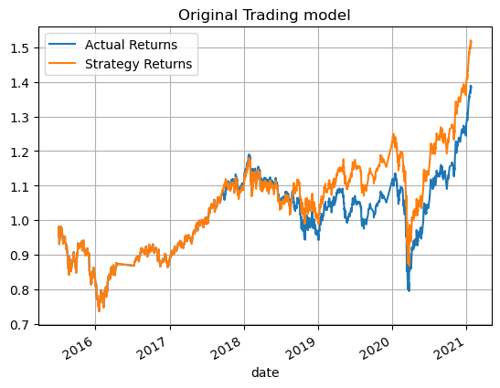
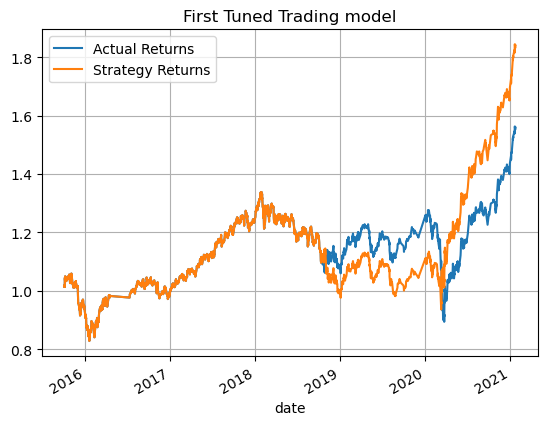
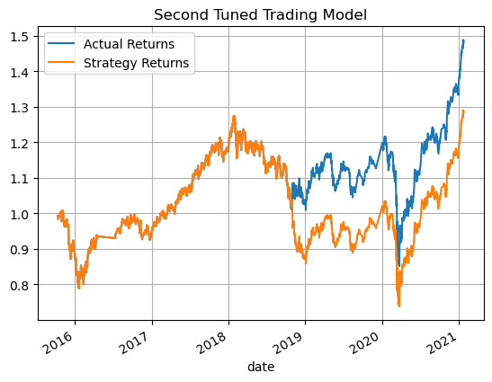
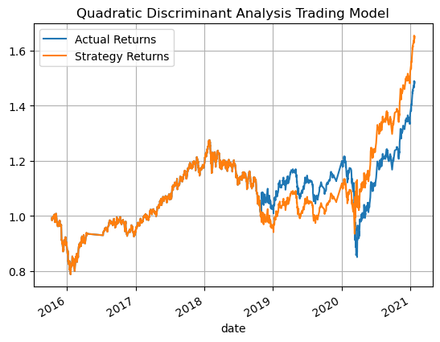

# $$-Machine-Learning-Algorithmic-Trading-Bot-$$

This repo contains a [Jupyter Notebook](./machine_learning_trading_bot.ipynb) that uses machine learning to create a algorithmic trading bots. 
In the sections below are the results of these bots. Using the backtesting method I trained [First Tuned Model](#original-trading-model) on a larger dataset than the original. 
The [Second Tuned Model](#second-tuned-trading-model) I adjsted the parameters of the slow and fast SMA values. 
I then used a [Quadratic Discriminant Analysis Trading Model](#quadratic-discriminant-analysis-trading-model) in the third tuned model.

---- 
 

## Original Trading Model
                precision    recall  f1-score   support

        -1.0        0.43      0.04     0.07      1804
         1.0        0.56      0.96     0.71      2288

    accuracy                           0.55      4092
    macro avg       0.49      0.50     0.39      4092
    weighted avg    0.50      0.55     0.43      4092

  

### In the orginal model we can see some divergence in late 2018 that resulted in lower than expected returns. 

[Return to Top](#machine-learning-algorithmic-trading-bot)

 

----
 

## First Tuned Trading Model
                precision    recall  f1-score   support

        -1.0       0.44      0.02      0.04      1732
         1.0       0.56      0.98      0.71      2211

    accuracy                            0.56      3943
    macro avg       0.50      0.50      0.38      3943
    weighted avg    0.51      0.56      0.42      3943

 

### In this model where the training data was increased the there is greater returns than in the 
### strategy between late 2018 up to the beginning of 2020. Actual returns where still higher than
### original model.

[Return to Top](#machine-learning-algorithmic-trading-bot)

  

---
 

## Second Tuned Trading Model
                precision    recall  f1-score   support

        -1.0       0.56      0.01      0.02      1791
         1.0       0.56      1.00      0.72      2278

    accuracy                            0.56      4069
    macro avg       0.56      0.50      0.37      4069
    weighted avg    0.56      0.56      0.41      4069

 

### The second tuned model had the slow and fast SMA adjusted with the updated training set.
### This resulted in a slightly higher actual returns.

[Return to Top](#machine-learning-algorithmic-trading-bot)

  

---
 

## Quadratic Discriminant Analysis Trading Model
                precision    recall  f1-score   support

        -1.0       0.42      0.11      0.18      1804
         1.0       0.56      0.88      0.68      2288

    accuracy                           0.54      4092
    macro avg      0.49      0.50      0.43      4092
    weighted avg   0.50      0.54      0.46      4092

 

### The Quadratic Discriminant Analysis Trading Model performed very
### simaler the orginal model on terms of actual returns.
### The stragey predicted much higher returns than the original.

[Return to Top](#machine-learning-algorithmic-trading-bot)

  

---

# $$-Conclusion-$$

Overall the Quadratic Discriminant Analysis Trading Model performed the best when it came to Actual Returns. 
Although non of the models where very good in their predictions. 
With only slightly better than 50% precision none of the models could be considered particularly useful. 

[Return to Top](#machine-learning-algorithmic-trading-bot)
---