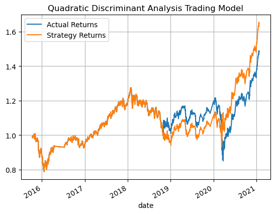

l

---- 
 

## Original Trading Model
                precision    recall  f1-score   support

        -1.0       0.43      0.04      0.07      1804
         1.0       0.56      0.96      0.71      2288

    accuracy                           0.55      4092
    macro avg       0.49      0.50     0.39      4092
    weighted avg    0.50      0.55     0.43      4092

  

----
 

## First Tuned Trading Model
                precision    recall  f1-score   support

        -1.0       0.42      0.11      0.18      1804
         1.0       0.56      0.88      0.68      2288

    accuracy                           0.54      4092
    macro avg      0.49      0.50      0.43      4092
    weighted avg   0.50      0.54      0.46      4092

  

---
 

## Second Tuned Trading Model
                precision    recall  f1-score   support

        -1.0       0.42      0.11      0.18      1804
         1.0       0.56      0.88      0.68      2288

    accuracy                           0.54      4092
    macro avg      0.49      0.50      0.43      4092
    weighted avg   0.50      0.54      0.46      4092

  

---
 

## Quadratic Discriminant Analysis Trading Model
                precision    recall  f1-score   support

        -1.0       0.42      0.11      0.18      1804
         1.0       0.56      0.88      0.68      2288

    accuracy                           0.54      4092
    macro avg      0.49      0.50      0.43      4092
    weighted avg   0.50      0.54      0.46      4092

  

---
j
